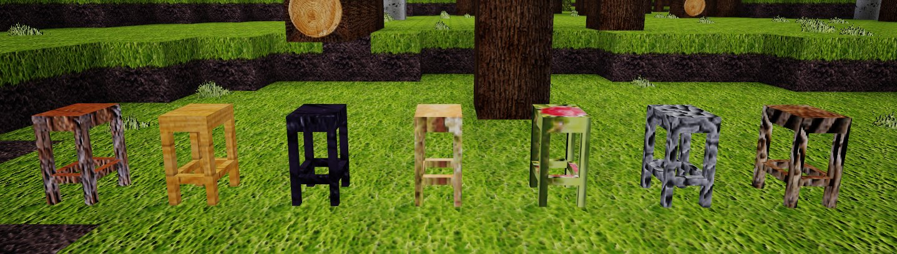

# Barchairs

This Mod adds Barchairs to Minetest.

## Install

Move your Download to the Mods-Folder. 
For additional support set barchairs.register_moretrees, barchairs.register_moreblocks or barchairs.register_cool_trees to true.

## Depends

default 

### optional
intllib, baldcypress, bamboo, birch, cacaotree, cherrytree, chestnuttree, clementinetree, ebony, holytree, jacaranda, larch, lemontree, mahogany, maple, oak, palm, plumtree, pomegranate, sequoia, willow, moretrees, moreblocks 

## For Admins

Barchairs supports moretrees, moreblocks or cooltrees, but this is deactivated by default.
To activate this mods, add the following lines: 
 
barchairs.register_moretrees = true 
barchairs.register_moreblocks = true 
barchairs.register_cool_trees = true 

## For Modwriter

### Function barchair.register_barchair(mod, mat, burnvalue)

With this interface, Barchairs can simply support your mod. 

mod = String of the current modname like "default:" 
mat = Material, is the name of the node like "dirt" 
burnvalue = Is the Chair burnable? 0 = not burnable, >= how long takes it to burn. If you don't give a valid Number, burnvalue = 0 and the chair is unburnable. 

## License

License: GPL 3.0
